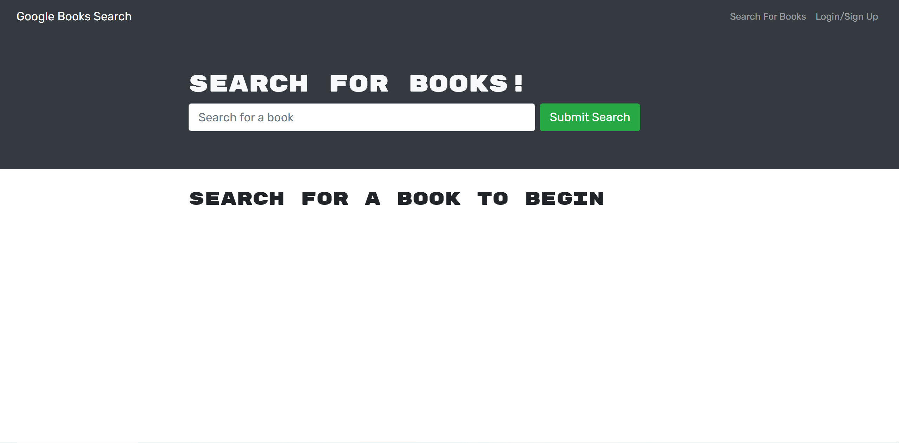
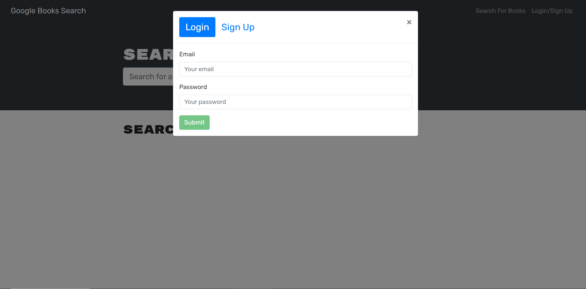
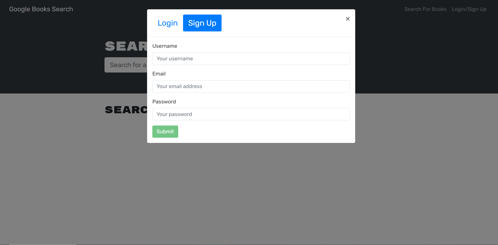
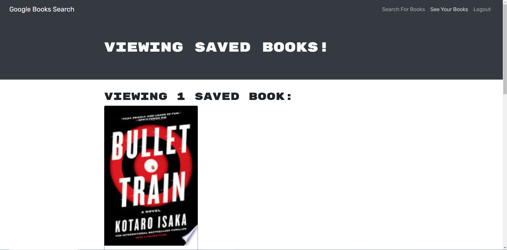

# Book Search Engine

## Description

- A simple search engine for books allowing user to search for books from goolebooks and save books to their account.
- Develope with React, Express and Apollo GraphQL

## Screenshot

Here is the main page for the application

Click top-right `login/sign-up` button to login and sign up.

You can search for books on the main page and 10 results will show.

If you are logged in, you can save books to your account.

Go to the `see your books` tab to see the saved result.

You can also delete books from your collection.

## Deployment

[Click to view the application](https://book-search-engine-22.herokuapp.com/)

## Contribution

Pull requests are welcome. For major changes, please open an issue first to discuss what you would like to change.

## License

MIT License 

Copyright (c) 2022 hmhtom

Permission is hereby granted, free of charge, to any person obtaining a copy
of this software and associated documentation files (the "Software"), to deal
in the Software without restriction, including without limitation the rights
to use, copy, modify, merge, publish, distribute, sublicense, and/or sell
copies of the Software, and to permit persons to whom the Software is
furnished to do so, subject to the following conditions:

The above copyright notice and this permission notice shall be included in all
copies or substantial portions of the Software.

THE SOFTWARE IS PROVIDED "AS IS", WITHOUT WARRANTY OF ANY KIND, EXPRESS OR
IMPLIED, INCLUDING BUT NOT LIMITED TO THE WARRANTIES OF MERCHANTABILITY,
FITNESS FOR A PARTICULAR PURPOSE AND NONINFRINGEMENT. IN NO EVENT SHALL THE
AUTHORS OR COPYRIGHT HOLDERS BE LIABLE FOR ANY CLAIM, DAMAGES OR OTHER
LIABILITY, WHETHER IN AN ACTION OF CONTRACT, TORT OR OTHERWISE, ARISING FROM,
OUT OF OR IN CONNECTION WITH THE SOFTWARE OR THE USE OR OTHER DEALINGS IN THE
SOFTWARE.
